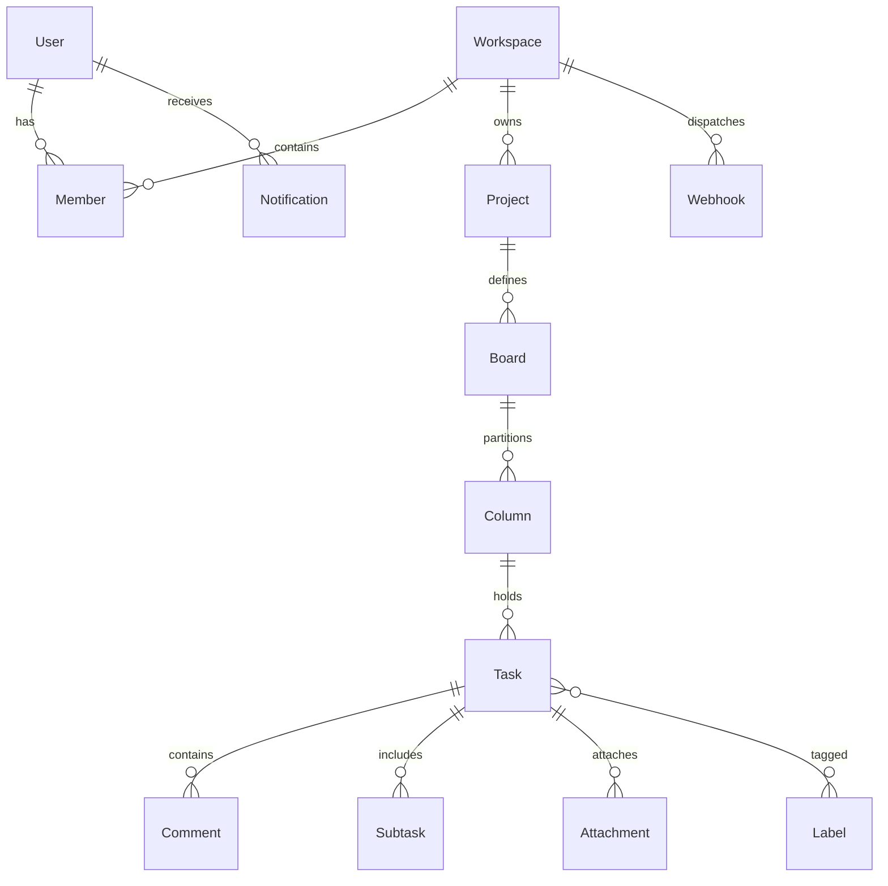

# Database Entity Relationship Documentation

The TaskFlow schema is modeled in PostgreSQL using Prisma ORM.

```mermaid
erDiagram
    User ||--o{ Member : has
    Workspace ||--o{ Member : contains
    Workspace ||--o{ Project : owns
    Project ||--o{ Board : defines
    Board ||--o{ Column : partitions
    Column ||--o{ Task : holds
    Task ||--o{ Comment : contains
    Task ||--o{ Subtask : includes
    Task ||--o{ Attachment : attaches
    Task }o--o{ Label : tagged
    Workspace ||--o{ Webhook : dispatches
    User ||--o{ Notification : receives
```
