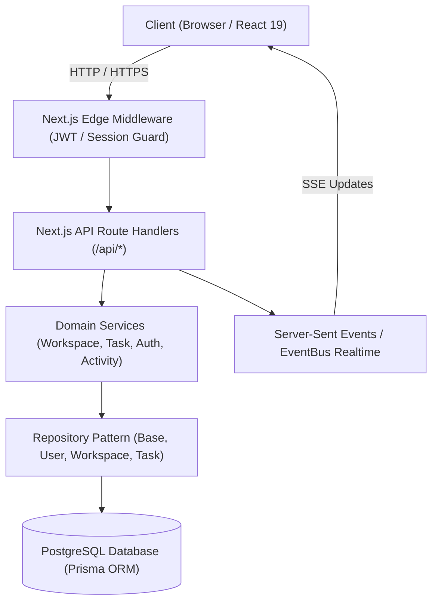

# System Architecture Overview

TaskFlow is architected as a lean, production-grade collaborative project management platform built on Next.js 16 (App Router) and TypeScript.

```mermaid
flowchart TD
    Client["Client (Browser / React 19)"]
    EdgeMiddleware["Next.js Edge Middleware (JWT / Session Guard)"]
    RouteHandlers["Next.js API Route Handlers (/api/*)"]
    ServiceLayer["Domain Services (Workspace, Task, Auth, Activity)"]
    RepositoryLayer["Repository Pattern (Base, User, Workspace, Task)"]
    Database[("PostgreSQL Database (Prisma ORM)")]
    EventStream["Server-Sent Events / EventBus Realtime"]

    Client -->|HTTP / HTTPS| EdgeMiddleware
    EdgeMiddleware --> RouteHandlers
    RouteHandlers --> ServiceLayer
    ServiceLayer --> RepositoryLayer
    RepositoryLayer --> Database
    RouteHandlers --> EventStream
    EventStream -->|SSE Updates| Client
```
